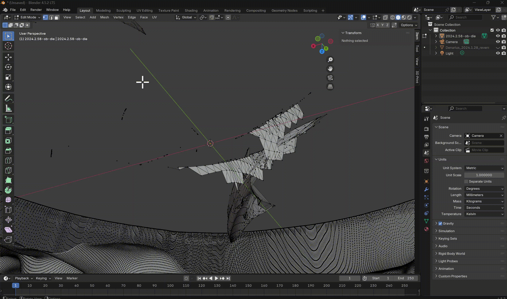

# How to make a coin in Blender

### Notes

In the OneDrive folder each subfolder should correlate with an object in the MAC

Step I in this guide is mandatory

You can then skip to step IV in this guide by going into one of the subfolders and making a copy of one of the coin face blender files

(the coin faces should be named something like 2024.2.58-obv.blend)

## I. Prepare the coin image files

1.  Download your coin face images from the [Lisanby museum site](https://jmu.emuseum.com/collections)

2.  (OPTIONAL) Use an image processing software to convert the images to black and white and increase the contrast
    - In Krita apply a desaturate filter
    - Apply a auto-contrast filter and then adjust levels
3.  (OPTIONAL) Use the contiguous selection tool (magic wand) to remove the background
    - If the coin is at all touching the edges of the image you should do this step and move it to the center
    - When exporting the image, set the transparent channel to be white (look this up if you don't know how)
4.  Upload the images to the Depth Anything model and generate depth maps of the images, download the grayscale version
    - [Depth Anything](https://huggingface.co/spaces/depth-anything/Depth-Anything-V2)
    - this model estimates the depth of everything in the image. It's used for autonomous robots :)

## II. Prepare the coin faces

1. Add a plane mesh in blender
   - press Shift+A in object mode
   - look under Mesh dropdown
2. Subdivide the plane to create more geometry
   - Tab then right click on plane after it's selected
   - Increase number of cuts in bottom left corner menu to 30
   - Tab again to switch back to object mode
3. Add a displace modifier from menu on the right
   - Hit new then click icon with switches (far right) to add the depth map to the plane
   - Set strength to about 0.5
4. Right click the mesh and shade auto smooth
5. Add a subdivision surface modifier and place it above the displace
   - up the levels to at least 3
   - do more levels if you have a beefier computer since you'll get more detail
6. (Optional): Add a smooth corrective modifier
   - select only smooth and bump repeat up to 10
   - I personally think this makes the model less defined
   - Since it's getting 3d printed it will get smoothed out a bit anyways

Should look something like this

- 

## III. Turning it 3D

1. Select the plane and add a solidify modifier (if it doesn't have one already)
   - This gives the plane some thickness and turn it 3D
2. Choose an appropriate thickness for the solidify modifier
   - Start out around 0.25 M
   - As the plane gets thicker, there might be fragments of its internal geometry that appear on the surface. The goal is to make it thick enough to make a coin face from it but not too thick so that the surface starts looking weird
   - It's ok if it looks weird as long as the face of the coin is intact.
3. Create a cylinder mesh
   - Press Shift + A in Object mode > Mesh > Cylinder
   - make sure its centered on the coin face
4. Position the cylinder
   - Make it overlap completely with the coin face, but not with the ugly bits at the bottom
   - Diameter should be slightly bigger than the coin
   - should look something like this
   - 
5. Apply a Boolean modifier on the plane mesh
   - select intersect and manifold solver
   - select the cylinder mesh under object
   - 
6. Make the cylinder invisible by clicking on the eye symbol in the top right menu
   - 
   - if all goes well, you should be left with the coin face
   - if there are fragments or weird geometry, you should maybe move the cylinder so its just the coin
7. Export as STL
   - File > Export > STL
   - This makes the geometry simpler for when we're stitching the two sides together

_Congrats you have finished your first coin face!_

## IV. Making a Second Face

1. Repeat Part I for the image of the other face of the coin
2. Make a copy of the coin face file & switch to that file in Blender
3. Go to the modifier menu on the plane and delete the Boolean Modifier
   - trust me it will make your life easier if you just redo it later
4. Find the Displace modifier and swap out the old depth map for the new depth map
   - click on the rightmost icon next to the texture name
   - 
   - Right under settings there a filename and a picture icon. Click on the file icon to put in your new depth map file
   - 
5. Make the cylinder visible so that it encapsulates the coin face but not any of the weird icky bits
6. Add the boolean modifier again
7. Export as STL
   - File > Export > STL

### _Optional_ Clean up Step

Sometimes there might be some weird geometry due to the experimental natural of this guide

Here are the steps I suggest:

1. after exporting the coin face as an STL, make a new blank blender file and then import your new STL
   - this seems redundant but actually makes your life way easier because of how blender works sorry
2. Go into edit mode and make sure you have a good view of the geometry you want to delete
   - press `Tab` to move into edit mode
   - The movement commands found in the Blender commands quick reference tab can be helpful to adjust your POV try to have the weird geometry against the blank background (nothing behind it)
     - don't try to delete anything weird that's on the inside or bottom of the coin it's not worth trust
3. Select and delete the geometry
   - use your mouse cursor and select the geometry
     - there are various selection modes you can choose from the left hand toolbar (look this up)
   - press `Delete` on your keyboard then select `Vertices`
   - 
4. Press `Tab` to go back to object mode

## V. Combine the faces

1. Make a new blender file
2. import the stls of both the obverse and the reverse
3. select one face and then flip it over
   - Press `R` then `X` then type in 180 and press `Enter`
