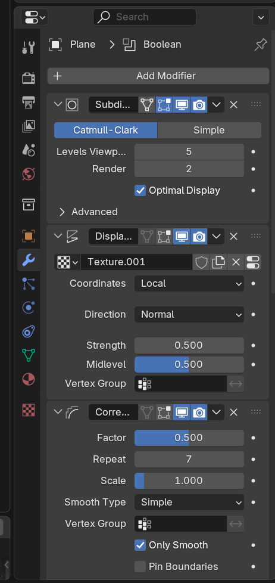
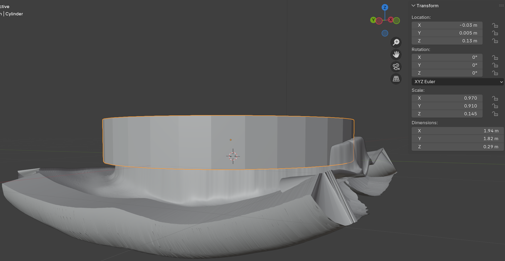
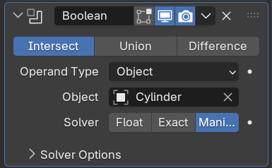
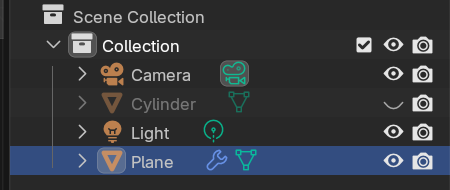
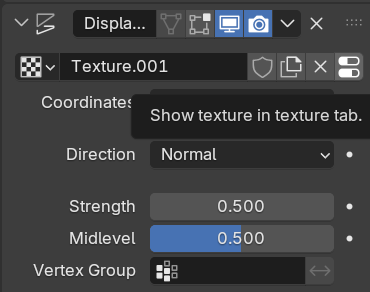
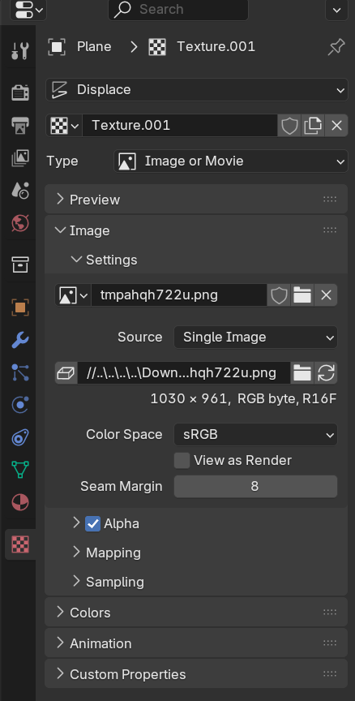

# How to make a coin in Blender

## I. Prepare the coin depth maps

1.  Download the items from the [Lisanby museum site](https://jmu.emuseum.com/collections)

2.  Use an image processing software to convert the images to black and white and increase the contrast
    - In Krita apply a desaturate filter
    - Apply a auto-contrast filter and then adjust levels
    - (Optional) Remove background and make it black. I think this gets better results
    - If the coin is touching the edges of the image you should move it to the center
    - Having a white background helps better than a black one
3.  Upload images to monocular vision model to generate depth maps, download the grayscale version
    - [monocular vision model](https://huggingface.co/spaces/depth-anything/Depth-Anything-V2)

## II. Prepare the coin faces

1. Add a plane mesh in blender
   - press Shift+A in object mode
   - look under Mesh dropdown
2. Subdivide the plane to create more geometry
   - Tab then right click on plane after it's selected
   - Increase number of cuts in bottom left corner menu to 30
   - Tab again to switch back to object mode
3. Add a displace modifier from menu on the right
   - Hit new then click icon with switches (far right) to add the depth map to the plane
   - Set strength to about 0.5
4. Right click the mesh and shade auto smooth
5. Add a subdivision surface modifier and place it above the displace
   - up the levels to at least 3
   - do more levels if you have a beefier computer since you'll get more detail
6. (Optional): Add a smooth corrective modifier
   - select only smooth and bump repeat up to 10
   - I personally think this makes the model less defined
   - Since it's getting 3d printed it will get smoothed out a bit anyways

Should look something like this

## III. Turning it 3D

1. Select the plane and add a solidify modifier (if it doesn't have one already)
   - This gives the plane some thickness and turn it 3D
2. Choose an appropriate thickness for the solidify modifier
   - Start out around 0.25 M
   - As the plane gets thicker, there might be fragments of its internal geometry that appear on the surface. The goal is to make it thick enough to make a coin face from it but not too thick so that the surface starts looking weird
   - It's ok if it looks weird as long as the face of the coin is intact.
3. Create a cylinder mesh
   - Press Shift + A in Object mode > Mesh > Cylinder
   - make sure its centered on the coin face
4. Position the cylinder
   - Make it overlap completely with the coin face, but not with the ugly bits at the bottom
   - Diameter should be slightly bigger than the coin
   - should look something like this
   - 
5. Apply a Boolean modifier on the plane mesh
   - select intersect and manifold solver
   - select the cylinder mesh under object
   - 
6. Make the cylinder invisible by clicking on the eye symbol in the top right menu
   - 
   - if all goes well, you should be left with the coin face
   - if there are fragments or weird geometry, you should maybe move the cylinder so its just the coin
7. Export as STL
   - File > Export > STL
   - This makes the geometry simpler for when we're stitching the two sides together

_Congrats you have finished a coin face!_

## IV. Making a Second Face

1. Repeat Part I for the image of the other face of the coin
2. Make a copy of the coin face file & switch to that file in Blender
3. Go to the modifier menu on the plane and delete the Boolean Modifier
   - trust me it will make your life easier if you just redo it later
4. Find the Displace modifier and swap out the old depth map for the new depth map
   - click on the rightmost icon next to the texture name
   - 
   - Right under settings there a filename and a picture icon. Click on the file icon to put in your new depth map file
   - 
5. Make the cylinder visible so that it encapsulates the coin face but not any of the weird icky bits
6. Add the boolean modifier again
